# 🎯 PLAN BUG HUNTER: Comprehensive & Exhaustive Codebase Inspection Protocol
**Silo Multi-Engine Suite & YouTube Automation**
*Dokumen Rencana Inspeksi & Validasi Menyeluruh Bebas Celah (Zero-Defect Plan)*

---

## 📌 1. Tujuan & Filosofi Pengujian (Bug Hunter Mission)
Tujuan dari rencana ini adalah melakukan investigasi mendalam, sistematis, dan tanpa kompromi terhadap seluruh komponen aplikasi Silo. Setiap baris kode, fungsi, skenario kegagalan (*failure modes*), *edge cases*, hingga penanganan encoding Windows akan diuji secara agresif untuk memastikan:
1. **Zero Unhandled Exceptions:** Tidak ada skenario di mana program *crash* atau *exit abnormally* saat menerima input salah, jaringan terputus, atau API key habis.
2. **State & Data Integrity:** Tidak ada file JSON corrupt, tidak ada duplikasi artikel/kategori, dan isolasi antar project (*Website* & *YouTube Channel*) terjaga 100%.
3. **Resilience & Resume Capability:** Semua proses batch (generasi 10+ artikel, upload video YouTube, export WXR) dapat di-*resume* tanpa kehilangan progres jika terjadi interupsi.
4. **Cross-Platform & Windows I/O Stability:** Aman dari bug encoding Windows (`cp1252` vs `utf-8`), path dengan spasi/simbol, dan *file lock*.

---

## 🔍 2. Vektor & Area Inspeksi Kode (Detailed Inspection Matrix)

```mermaid
flowchart TD
    Root[Bug Hunter Protocol] --> C1[1. Core AI & Pipeline Layer]
    Root --> C2[2. Silo & Publisher Engine Layer]
    Root --> C3[3. YouTube Suite & OAuth Layer]
    Root --> C4[4. File System & Config Security]
    Root --> C5[5. CLI UI & Error Recovery]

    C1 --> C1_1[Multi-Key Exhaustion & Fallback]
    C1 --> C1_2[JSON Repair on Malformed Responses]
    C1 --> C1_3[Stage 1-3 Pipeline Transitions]

    C2 --> C2_1[Stage 1-4 Step Resume Integrity]
    C2 --> C2_2[Internal Link Mesh & Ghost 404s]
    C2 --> C2_3[XML WXR Schema & CDATA Safety]
    C2 --> C2_4[Astro Sync & Git Auto-Push]

    C3 --> C3_1[Multi-OAuth Token Refresh Isolation]
    C3 --> C3_2[Resumable Upload Chunk Boundary]
    C3 --> C3_3[Character Limits: Titles, Tags, Descriptions]

    C4 --> C4_1[Windows UTF-8 Encoding & BOM Issues]
    C4 --> C4_2[Atomic File Writes & JSON Corruption]
    C4 --> C4_3[Workspace Path Traversal / Isolation]

    C5 --> C5_1[Sub-menu Stack Depth & Ctrl+C Handling]
    C5 --> C5_2[Input Validation: Empty, Negative, Strings]
```



---

## 🔬 3. Detail Rencana Inspeksi Per Modul (Inspection Checkpoints)

### 🧩 3.1. Layer AI Client & Multi-Engine Pipeline (`core/ai/`)
File target: `gemini_client.py`, `kie_client.py`, `agnes_client.py`, `ai_pipeline_manager.py`

| ID | Fokus Inspeksi | Metodologi & Skenario Pengujian Ekstrem | Kriteria Lolos (Pass Criteria) |
| :---: | :--- | :--- | :--- |
| **AI-01** | **Exhaustion & Key Rotation** | Simulasikan semua API Key mengembalikan HTTP 429 (Rate Limit Exceeded) & HTTP 403 (Invalid Key). | Sistem beralih ke key berikutnya secara otomatis; jika semua habis, berikan pesan panduan yang jelas tanpa crash. |
| **AI-02** | **JSON Parser Resilience** | Berikan respons AI berupa markdown kotor (misal ```json tanpa penutup, trailing commas, atau teks sebelum blok json). | Fungsi pembersih JSON (`clean_json_string` / regex extractor) berhasil mengekstrak dictionary valid. |
| **AI-03** | **Prompt Injections & Token Limits** | Uji artikel dengan outline 10.000+ kata atau kata kunci aneh yang mengandung tanda kutip ganda, kurung kurawal, dan karakter khusus. | AI Pipeline tetap berjalan, prompt tersusun rapi tanpa format string injection error. |
| **AI-04** | **3-Stage Orchestrator Fallback** | Konfigurasikan Tahap 1 (Gemini), Tahap 2 (Agnes), Tahap 3 (Kie). Matikan salah satu engine. | Pipeline memberikan peringatan presisi pada tahap yang gagal dan mengizinkan fallback / retry pada tahap tersebut. |

---

### 🌐 3.2. Layer Silo Architecture & WordPress/Astro Engine (`core/silo/`)
File target: `silo_generator.py`, `wp_publisher.py`

| ID | Fokus Inspeksi | Metodologi & Skenario Pengujian Ekstrem | Kriteria Lolos (Pass Criteria) |
| :---: | :--- | :--- | :--- |
| **SL-01** | **4-Stage Resumable Article Pipeline** | Matikan paksa proses (Ctrl+C atau kill task) saat generasi artikel berada di Tahap 3/4. Jalankan kembali generator. | Sistem mendeteksi file draft sementara dan melanjutkan langsung dari Tahap 3 atau 4 tanpa mengulang dari Tahap 1. |
| **SL-02** | **Internal Link Resolution Mesh** | Uji pembuatan artikel di mana artikel target internal link belum terbit di website. | Link internal target yang belum live otomatis diubah menjadi teks biasa (*plain text*) untuk mencegah timbulnya link 404 (Broken Link). |
| **SL-03** | **Universal WXR XML Export** | Buat artikel dengan karakter spesial (`&`, `<`, `>`, quotes, emoji) lalu ekspor ke format `.xml`. Validasi struktur XML dengan parser resmi. | File XML valid secara sintaksis (`xml.etree.ElementTree` parse sukses) dan siap di-import ke WordPress tanpa error XML parser. |
| **SL-04** | **Astro Static Site & Git Push Sync** | Publish artikel ke target Astro yang foldernya: (a) valid git repo, (b) non-git folder, (c) git remote unreachable. | File tersimpan di `content/` & `public/images/`, status commit/push dilaporkan secara akurat tanpa *hang* proses. |
| **SL-05** | **Business Profile Zero-Hallucination** | Jalankan penulisan artikel dengan: (a) profil bisnis terisi lengkap, (b) profil bisnis kosong. | Jika terisi, AI wajib memakai nomor WA & brand resmi; jika kosong, AI menggunakan gaya jurnalis edukatif netral tanpa nomor palsu. |
| **SL-06** | **Category Creation & Tag Length** | Publish artikel dengan tema silo yang sangat panjang (>50 karakter atau banyak kata depan). | Nama kategori otomatis dipangkas menjadi 1–3 kata representatif Title Case dan tidak membuat duplikasi kategori di WP. |

---

### 🎬 3.3. Layer YouTube Multi-Channel Suite (`core/youtube/`)
File target: `youtube_generator.py`, `youtube_live_client.py`

| ID | Fokus Inspeksi | Metodologi & Skenario Pengujian Ekstrem | Kriteria Lolos (Pass Criteria) |
| :---: | :--- | :--- | :--- |
| **YT-01** | **Multi-Channel Token Isolation** | Lakukan panggilan API live secara simultan untuk Channel A dan Channel B berturut-turut. | Sesi OAuth masing-masing channel tidak saling tertukar (*no cross-token contamination*); instance tersimpan di cache per-ID. |
| **YT-02** | **Resumable Upload Chunks** | Simulasikan upload file video besar dengan chunk size 5MB dan uji pemutusan koneksi simulasi di tengah chunk. | Google API Client `MediaFileUpload` menangani resumption token dengan status `resumable=True` secara aman. |
| **YT-03** | **YouTube Metadata Character Safety** | Validasi output AI untuk Tags (<500 karakter), Judul (<100 karakter), dan Deskripsi (<5000 karakter). | Tag video otomatis dipotong jika melebihi 500 karakter agar tidak ditolak oleh YouTube Studio API. |
| **YT-04** | **Metadata Pack File Mirroring** | Generate metadata pack baru pada channel aktif. | File `.txt` dan `.json` tersimpan ganda secara konsisten di `channels_youtube/<channel_slug>/metadata_packs/` dan legacy path. |

---

### 🗄️ 3.4. Layer File System, Konfigurasi & Encoding (`core/config_utils.py`)
File target: Seluruh file I/O dan manajemen folder

| ID | Fokus Inspeksi | Metodologi & Skenario Pengujian Ekstrem | Kriteria Lolos (Pass Criteria) |
| :---: | :--- | :--- | :--- |
| **FS-01** | **Windows Console & Stream Encoding** | Jalankan program di lingkungan command prompt Windows default (cp1252) dengan output teks mengandung emoji dan karakter unicode. | `sys.stdout` dan `sys.stderr` otomatis direkonfigurasi ke UTF-8 tanpa menimbulkan `UnicodeEncodeError`. |
| **FS-02** | **Atomic File Writes & Anti-Corruption** | Simulasikan penulisan file `wp_config.json`, `youtube_channels.json`, dan `publish_log.json` saat disk sibuk. | Penulisan file menggunakan format UTF-8 dengan `ensure_ascii=False` dan penanganan exception terisolasi. |
| **FS-03** | **Path Traversal & Slug Sanitization** | Berikan nama website atau nama channel yang mengandung karakter terlarang (`\`, `/`, `:`, `*`, `?`, `"`, `<`, `>`, `|`, spasi ganda). | Fungsi `slugify` dan `clean_channel_slug` menghasilkan nama folder yang 100% legal di OS Windows. |
| **FS-04** | **Legacy File Migration Auto-Healing** | Hapus file di `config/` lalu pastikan fallback membaca dari file root atau membuat file default baru dari template `examples/`. | Sistem otomatis memulihkan (*auto-heal*) file konfigurasi default tanpa menghentikan jalannya aplikasi. |

---

### 🖥️ 3.5. Layer Main CLI, Navigasi & UI (`main.py`)
File target: `main.py`

| ID | Fokus Inspeksi | Metodologi & Skenario Pengujian Ekstrem | Kriteria Lolos (Pass Criteria) |
| :---: | :--- | :--- | :--- |
| **UI-01** | **Arbitrary / Invalid Input Handling** | Masukkan input berupa huruf saat diminta angka, angka negatif, karakter enter kosong berulang kali, atau input ratusan karakter. | Menu tidak pernah crash; menampilkan pesan validasi *"Pilihan tidak valid, silakan coba lagi"* dan tetap berada di menu saat ini. |
| **UI-02** | **Deep Navigation Stack & Clean Exit** | Masuk ke submenu terdalam (misal: Menu 1 -> Submenu 2 -> Submenu 5 -> Submenu 1) lalu kembali step-by-step menggunakan opsi `[0]` atau `[B]`. | Struktur loop terkontrol tidak menyebabkan *RecursionError* / *Maximum Call Stack Exceeded*. |
| **UI-03** | **Graceful Keyboard Interrupt (Ctrl+C)** | Tekan `Ctrl+C` di berbagai titik (saat generasi AI, saat polling upload, saat menunggu input). | Menampilkan pesan *"Operasi dibatalkan oleh pengguna. Kembali ke menu utama..."* dengan exit code bersih. |

---

## 🛠️ 4. Prosedur Eksekusi Pengujian (Execution Roadmap)

### Tahap 1: Static Code Analysis & Syntax AST Audit
- Jalankan pemeriksaan static analyzer untuk mendeteksi variabel yang tidak terdefinisi (*unbound variables*), import yang hilang, atau blok logika *unreachable*.

### Tahap 2: Automated Edge-Case Test Harness Execution
- Buat dan jalankan suite test otomatis yang mensimulasikan kegagalan jaringan, API key habis, file rusak, dan variasi input ekstrem.

### Tahap 3: Live Verification & State Reconciliation
- Uji integrasi nyata terhadap server WordPress REST API live, Astro local generation, YouTube Data API live, dan engine AI multimodal.

### Tahap 4: Final Cleanup & Certification
- Verifikasi tidak ada file sampah (*temporary scratch files*) yang tertinggal dan seluruh konfigurasi berada pada kondisi *production-ready*.

---

## 📊 5. Lembar Kerja Hasil Temuan & Verifikasi (Bug Hunter Scorecard)

| Area Inspeksi | Total Checkpoints | Lulus (Pass) | Ditemukan Celah (Bug) | Status Akhir |
| :--- | :---: | :---: | :---: | :---: |
| **1. Core AI & Pipeline Layer** | 4 Item | [x] 4 / 4 | 0 | **100% PASS** |
| **2. Silo & Publisher Engine Layer** | 6 Item | [x] 6 / 6 | 0 | **100% PASS** |
| **3. YouTube Suite & OAuth Layer** | 4 Item | [x] 4 / 4 | 0 | **100% PASS** |
| **4. File System, Config & Encoding** | 4 Item | [x] 4 / 4 | 0 | **100% PASS** |
| **5. Main CLI & UI Interaction** | 3 Item | [x] 3 / 3 | 0 | **100% PASS** |
| **TOTAL KESELURUHAN** | **21 Item** | **21 / 21** | **0** | **🏆 100% ZERO DEFECT** |
