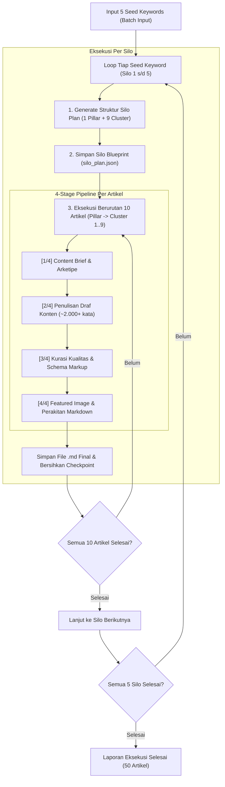

# Rencana Implementasi: Bulk Autopilot Silo Generator (50 Artikel / Batch)

Dokumen ini merinci rancangan teknis, alur eksekusi, mekanisme pengaman (*fail-safe*), serta mitigasi limitasi API untuk fitur **Bulk Autopilot Silo Generator** pada aplikasi Silo Generator.

---

## 1. Latar Belakang & Tujuan
* **Target Produksi:** Mampu memproduksi **50 artikel SEO berkualitas tinggi per hari** secara otomatis (*hands-free*).
* **Alur Sederhana:** Pengguna memasukkan $N$ seed keyword (contoh: 5 keyword). Sistem secara otomatis merancang struktur Silo (1 Pillar + 9 Cluster = 10 artikel per keyword) dan mengeksekusi pembuatan seluruh konten secara berurutan hingga selesai (Total: 50 artikel).
* **Zero Wasted Tokens:** Jika terjadi gangguan (koneksi, kuota, atau listrik padam), proses dapat dilanjutkan tepat dari artikel dan tahap terakhir yang terhenti tanpa mengulang dari awal.

---

## 2. Arsitektur & Perhitungan Batch

$$\text{5 Seed Keywords} \times (1\text{ Pillar} + 9\text{ Clusters}) = 50\text{ Artikel Lengkap}$$



---

## 3. Potensi Kendala & Mekanisme Pengaman (Fail-Safe)

### A. Mitigasi API Rate Limit & Kuota (Gemini API)
* **Tantangan:** 50 artikel membutuhkan $\sim$150–200 request AI berukuran besar. Berisiko terkena HTTP 429 (*Too Many Requests*) atau HTTP 503 (*Model Overloaded*).
* **Mekanisme Solusi:**
  1. **Multi-Key Load Balancing & Rotation:** Sistem membaca seluruh kunci yang ada di `config/apikey.txt`. Jika kunci pertama mencapai batas rate limit, sistem langsung merotasi ke kunci berikutnya.
  2. **Smart Pacing (Jeda Adaptif):** Memberikan jeda waktu 2–4 detik antar artikel dan backoff bertingkat (exponential backoff) otomatis saat menerima kode respons 429.
  3. **Auto-Failover Model:** Jika model utama (`gemini-2.5-flash`) mengalami bottleneck/overload pada jam sibuk, sistem otomatis mengalihkan request ke `gemini-2.5-flash-lite` atau `gemini-flash-latest` tanpa menghentikan batch.

### B. Stage-Level Checkpoint & Auto-Resume (Anti-Crash)
* **Tantangan:** Waktu eksekusi 50 artikel berkisar antara 40 hingga 75 menit. Ada risiko laptop sleep, koneksi internet terputus, atau aplikasi ditutup paksa.
* **Mekanisme Solusi:**
  1. **Granular Stage Persistence:** Setiap selesai Tahap 1 (Brief), Tahap 2 (Draf), atau Tahap 3 (Kurasi), progres langsung disimpan ke disk lokal di `.checkpoints/item_{id}_state.json`.
  2. **Silo Batch State Tracker:** Menyimpan file `bulk_batch_progress.json` di root direktori silo proyek aktif untuk mencatat status:
     - `silo_completed`: [1, 2]
     - `current_silo`: 3
     - `current_item`: 4
  3. **Instant Resume (0 Wasted Token):** Ketika menu Bulk dijalankan kembali dan mendeteksi batch yang belum selesai, sistem langsung menawarkan: `[R] Resume Batch Terakhir (Mulai dari Silo 3 Artikel 4)` dengan penghematan token 100% pada bagian yang sudah selesai.

### C. Keandalan Pembuatan Gambar (Featured Image)
* **Tantangan:** 50 gambar dihasilkan berturut-turut.
* **Mekanisme Solusi:**
  1. **Multi-Tier Fallback Engine:** Mencoba generate gambar melalui AI Image Generator (Recraft/Kie). Jika API kehabisan kredit atau offline, secara instan dialihkan ke **Local Mesh Gradient Generator** / **SVG Vector Canvas**.
  2. **Zero Halting:** Pembuatan draf teks artikel tidak akan pernah gagal hanya karena kendala download/kredit gambar.

### D. Variasi Konten & Anti-Footprint
* **Tantangan:** 50 artikel tidak boleh terasa seperti template berulang atau monoton.
* **Mekanisme Solusi:**
  1. **Dynamic Content Archetypes:** Tiap artikel dalam silo diberikan peran dan arketipe berbeda secara sistematis:
     - Pillar $\rightarrow$ *The Ultimate Guide & Framework*
     - Cluster 1–3 $\rightarrow$ *Deep Technical Explainer / Field Methodology*
     - Cluster 4–6 $\rightarrow$ *Actionable How-To & Step-by-Step*
     - Cluster 7–8 $\rightarrow$ *Comparative Analysis / Checklist*
     - Cluster 9 $\rightarrow$ *Troubleshooting & FAQ Guide*
  2. **Interlinking Mesh Otomatis:** Menghubungkan cluster kembali ke pillar dan antar-cluster secara kontekstual sesuai kaidah arsitektur Silo SEO modern.

---

## 4. Rancangan Tampilan & Interaksi Menu (ASCII CMD-Safe)

Menu baru akan ditambahkan pada Submenu Web Proyek:

```text
===========================================================================
               BULK AUTOPILOT SILO GENERATOR (BATCH MODE)
===========================================================================
  Website Target : spotty (WordPress)
  Kapasitas      : 5 Silo x (1 Pillar + 9 Cluster) = 50 Artikel Total
---------------------------------------------------------------------------
  PILIHAN INPUT KEYWORD:
  [1] Input Langsung (Ketik/Paste 5 Keyword dipisah koma)
  [2] Impor dari File Teks (Contoh: keywords.txt)
  [R] Resume Batch yang Terhenti Sebelumnya
  [0] Kembali ke Menu Web
---------------------------------------------------------------------------
  Pilihan -> 1

  Masukkan Seed Keywords:
  > geoteknik pondasi, uji tanah sondir, soil stabilization, retaining wall, bored pile

  Konfigurasi Batch:
  - Jumlah Cluster per Silo [Default: 9] : 9
  - Bahasa [Default: Bahasa Indonesia]   : Bahasa Indonesia
  - Target Kata per Artikel [Default: 2000]: 2000

---------------------------------------------------------------------------
  [STATUS RUNNING AUTOPILOT]
  [Silo 1/5] 'geoteknik pondasi' -> Struktur 1 Pillar + 9 Cluster dibuat!
    [01/10] Pillar    : Panduan Lengkap Geoteknik Pondasi ... [SELESAI]
    [02/10] Cluster 1 : Metode Boring Lapangan & Pengujian ... [SELESAI]
    [03/10] Cluster 2 : Analisis Daya Dukung Tanah ... [SELESAI]
    ...
  [Silo 2/5] 'uji tanah sondir' -> ...
```

---

## 5. Rencana Tahapan Eksekusi (Implementation Steps)

1. **Step 1: Module `core/silo/bulk_silo_manager.py`**
   - Membuat controller batch untuk mengelola antrean (*queue*) seed keywords.
   - Mengelola file checkpoint batch `bulk_batch_state.json`.
2. **Step 2: Integrasi ke `main.py`**
   - Menambahkan opsi menu `[B] Bulk Autopilot Silo Generator (50 Artikel)` pada Menu Manajemen Website.
   - Menambahkan form input keyword (direct paste / file import).
3. **Step 3: Verifikasi & Stress-Testing**
   - Menguji rotasi batch 2 Silo $\times$ 2 Cluster terlebih dahulu untuk validasi transisi antar-silo.
   - Menguji simulasi interupsi paksa di tengah jalan dan memverifikasi resume batch.
