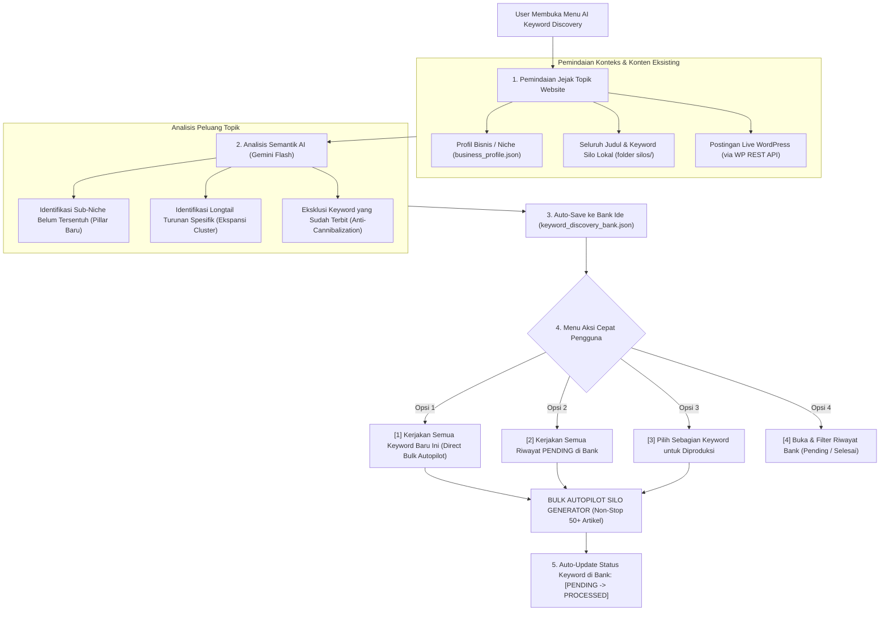

# Rencana Implementasi: AI Keyword Discovery Bank & Auto-Bulk Integration

Dokumen ini merinci rancangan teknis, arsitektur data, alur eksekusi, serta integrasi otomatis antara **AI Topical Gap Discovery Engine**, **Keyword Stock Bank (Auto-Persistence)**, dan **Bulk Autopilot Silo Generator**.

---

## 1. Latar Belakang & Tujuan
* **Mengatasi Writer's Block:** Membantu pemilik website/PBN menemukan ide topik baru yang relevan dengan niche secara otomatis ketika kehabisan stok keyword.
* **Anti-Kanibalisasi Konten (Zero Footprint Duplicate):** Memindai seluruh artikel yang sudah ada di website (baik lokal maupun live WP/Astro) agar rekomendasi keyword 100% segar dan tidak bentrok dengan konten yang sudah terbit.
* **Auto-Persistence (Keyword Bank):** Hasil riset otomatis tersimpan permanen di `keyword_discovery_bank.json` tanpa perlu klik simpan manual.
* **Direct 1-Click Bulk Execution:** Terhubung langsung ke mesin **Bulk Autopilot Silo Generator** untuk memproduksi artikel secara masal dari ide-ide baru atau riwayat backlog yang tertunda.

---

## 2. Arsitektur & Alur Kerja Terpadu



---

## 3. Struktur Data `keyword_discovery_bank.json`

Setiap website di `projects_web/<site_slug>/` memiliki database keyword bank mandiri:

```json
{
  "site_id": "site_1",
  "site_name": "spotty",
  "last_discovered_at": "2026-09-28T06:00:00",
  "total_keywords": 25,
  "pending_count": 15,
  "processed_count": 10,
  "keywords": [
    {
      "id": "kw_20260928_001",
      "keyword": "soil stabilization dengan semen dan kapur",
      "type": "pillar_baru",
      "parent_pillar": null,
      "search_intent": "Informational / Komersial",
      "authority_value": "Tinggi",
      "status": "pending",
      "discovered_at": "2026-09-28T06:00:00",
      "processed_at": null,
      "silo_folder": null
    },
    {
      "id": "kw_20260928_002",
      "keyword": "standar sni pengujian sondir tanah",
      "type": "cluster_expansion",
      "parent_pillar": "uji-tanah-sondir",
      "search_intent": "Spesifikasi Teknis",
      "authority_value": "Sedang",
      "status": "processed",
      "discovered_at": "2026-09-28T06:00:00",
      "processed_at": "2026-09-28T06:45:00",
      "silo_folder": "uji-tanah-sondir"
    }
  ]
}
```

---

## 4. Mekanisme & Logika Inti Modul

### A. Modul `core/silo/keyword_discovery.py`
1. **`scan_website_footprint(site)`**:
   - Membaca data profil bisnis (`business_profile.json`).
   - Membaca semua `SILO_BLUEPRINT.md` dan file `.md` di folder `silos/`.
   - Mengambil daftar judul post live dari WordPress via endpoint `/wp/v2/posts?per_page=100`.
   - Mengumpulkan daftar keyword & topik yang sudah dipakai (*blacklist keywords*).
2. **`discover_topical_gaps(site, client, count=15)`**:
   - Menyusun prompt komprehensif ke Gemini AI berisi:
     - Niche & USP website
     - Daftar topik yang sudah ada (untuk dihindari)
     - Permintaan 10–20 keyword baru terbagi atas: (1) Pillar Baru yang relevan, (2) Cluster baru turunan dari pillar yang sudah ada.
   - Mengembalikan data terstruktur JSON valid.
3. **`save_to_bank(site, new_keywords)`**:
   - Otomatis menggabungkan keyword baru ke `keyword_discovery_bank.json`.
   - Menghapus duplikasi keyword yang sudah ada di bank.
4. **`mark_keyword_processed(site, keyword_str, silo_folder_name)`**:
   - Mengubah status keyword di bank menjadi `processed` saat Silo berhasil dibuat.

---

## 5. Rancangan Tampilan Menu Terminal (CMD-Safe)

Menu baru akan ditambahkan pada Dashboard Website Project:

```text
===========================================================================
               DASHBOARD PROJECT: SPOTTY
===========================================================================
 [*] Tipe Website  : WordPress REST API
 [Web] URL / Target: https://spotty.id
 [Business] Profil : Spotty Soil & Foundation Specialist
 [Folder] Workspace: C:\Users\Hendro\Silo\projects_web\spotty
  Koleksi Silo  : 2 Silo (18 Artikel Selesai, 0 Pending)
  Stok Ide Bank : 15 Keyword Pending di Bank Ide
---------------------------------------------------------------------------
 [1] [Target] Riset & Buat Arsitektur Silo Baru (Single Silo)
 [2] [Auto]   Bulk Autopilot Silo Generator (Multi-Keyword Non-Stop)
 [3] [Idea]   AI Keyword & Topical Gap Discovery (Bank Stok Ide)
 [4] [Folder] Kelola & Lanjutkan Silo Web Ini (2 Silo)
 [5] [Publish] Publish Artikel ke Web Ini
 [6] [Live]   Kelola Post Live di Web Ini (WordPress)
 [7] [Business] Profil Bisnis & Knowledge Grounding Web Ini
 [8] [Key]    Pengaturan Kredensial & Uji Koneksi Web Ini
 [9] [Config] Pengaturan Bulk Silo (Cluster, Bahasa, Pacing)
 [0] Kembali ke Daftar Website
```

Ketika menu **`[3] AI Keyword & Topical Gap Discovery`** dibuka:

```text
===========================================================================
             AI TOPICAL GAP & KEYWORD DISCOVERY BANK
===========================================================================
  Website Target : spotty (WordPress)
  Stok Ide Bank  : Total 25 Keyword (15 Pending, 10 Selesai)
---------------------------------------------------------------------------
  HASIL DISCOVERY TERBARU (10 Keyword Fresh Ditemukan & Tersimpan):
  #01. [Pillar Baru] soil stabilization semen dan kapur      [PENDING]
  #02. [Pillar Baru] metode retaining wall bronjong lereng    [PENDING]
  #03. [Cluster Baru] standar sni pengujian sondir tanah      [PENDING] (Induk: uji-tanah-sondir)
  #04. [Cluster Baru] perbandingan bored pile vs strauss pile [PENDING] (Induk: bored-pile-mini)
  ...
---------------------------------------------------------------------------
  AKSI CEPAT (DIRECT BULK EXECUTION):
  [1] [!] Kerjakan SEMUA 10 Keyword Baru Ini Sekarang (Direct Bulk Autopilot)
  [2] [!] Kerjakan SEMUA 15 Riwayat Ide PENDING di Bank (Direct Bulk Autopilot)
  [3] [>] Pilih Beberapa Keyword Tertentu untuk Diproduksi
  [4] [=] Buka & Kelola Seluruh Riwayat Stok Ide di Bank
  [5] [R] Jalankan Ulang AI Discovery (Cari Peluang Tambahan)
  [0]     Kembali ke Dashboard Web
```

---

## 6. Rencana Tahapan Eksekusi (Implementation Steps)

1. **Step 1: Module `core/silo/keyword_discovery.py`**
   - Membangun class `KeywordDiscoveryManager` untuk scanning jejak web, prompt AI discovery, dan database JSON `keyword_discovery_bank.json`.
2. **Step 2: Integrasi ke `core/silo/__init__.py` & `main.py`**
   - Menambahkan menu `[3] AI Keyword & Topical Gap Discovery` di dashboard website.
   - Menghubungkan tombol aksi eksekusi langsung ke `bulk_silo_autopilot_flow`.
3. **Step 3: Pengujian Live & Verifikasi**
   - Menguji pemindaian artikel eksisting pada website aktif (`spotty`).
   - Memverifikasi auto-persistence file bank dan transisi status `pending` $\rightarrow$ `processed`.
